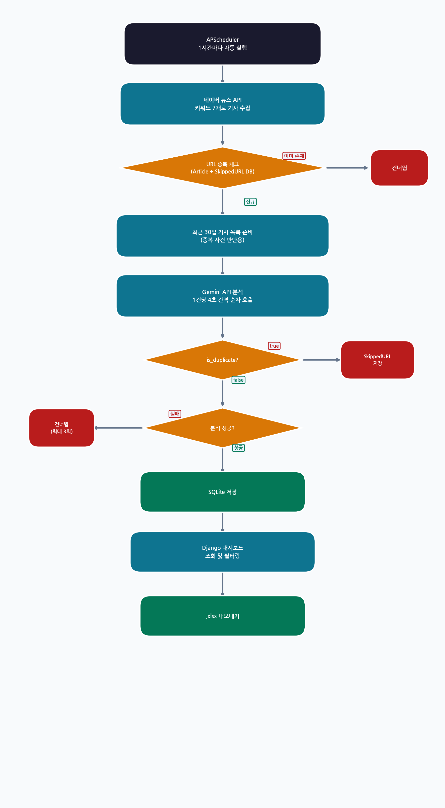

# Legal Radar

소송금융 투자 검토를 위한 뉴스 자동 수집 및 AI 분석 시스템

네이버 뉴스 검색 API로 소송 관련 기사를 1시간마다 자동 수집하고, Gemini AI가 소송금융 투자 적합도를 분석하여 Django 대시보드로 시각화합니다.

기사 수집 방식으로 크롤링은 사용하지 않았습니다. 사이트 HTML 구조 변경 시 크롤러가 즉시 중단되는 유지보수 문제, 그리고 뉴스 사이트 이용약관 위반 및 상업적 목적 시 저작권법 위반 소지가 있는 법적 문제 때문입니다. 대신 네이버 공식 API만 사용하여 안정성과 법적 안전성을 모두 확보했습니다.

---

## 목차

- [🚀 실행 방법](#-실행-방법)
- [📌 프로젝트 개요](#-프로젝트-개요)
- [🔄 데이터 처리 흐름](#-데이터-처리-흐름)
- [⚙️ 기술 스택](#️-기술-스택)
- [📁 프로젝트 구조](#-프로젝트-구조)
- [🔑 환경변수 설명](#-환경변수-설명)
- [📊 주요 기능](#-주요-기능)
- [🤖 AI 분석 항목](#-ai-분석-항목)
- [📡 API 사용량 관리](#-api-사용량-관리)
- [🗂️ Django Admin](#️-django-admin)
- [📝 수집 키워드](#-수집-키워드)

---

## 🚀 실행 방법

### Docker로 실행 (권장)

1. `.env` 파일 생성

```bash
cp .env.example .env
```

`.env` 파일을 열어 API 키를 입력합니다.

```env
NAVER_CLIENT_ID=네이버_API_클라이언트_ID
NAVER_CLIENT_SECRET=네이버_API_클라이언트_시크릿
GEMINI_API_KEY=제미나이_API_키
SECRET_KEY=Django_시크릿_키
DEBUG=True
```

2. Docker Compose로 실행

```bash
docker-compose up --build
```

3. 브라우저에서 접속

```
http://localhost:8000
```

> DB는 Docker Volume(`sqlite-data`)에 저장되므로 컨테이너를 재시작해도 데이터가 유지됩니다.

---

### 로컬에서 실행

1. 패키지 설치

```bash
pip install -r requirements.txt
```

2. `.env` 파일 생성 및 API 키 입력

```bash
cp .env.example .env
```

3. 마이그레이션 실행

```bash
python manage.py migrate
```

4. 서버 실행

```bash
python manage.py runserver
```

5. 브라우저에서 접속

```
http://localhost:8000
```

---

## 📌 프로젝트 개요

로앤굿(LawnGood)의 소송금융 투자 심사 업무를 지원하기 위한 뉴스 모니터링 도구입니다.

매일 수백 건의 소송 관련 뉴스 중에서 투자 가치 있는 사건을 빠르게 식별하는 것이 목적입니다. AI가 각 기사를 분석하여 `High / Medium / Low` 3단계로 투자 적합도를 판단하고, 중복 사건을 자동으로 걸러냅니다.

| 항목 | 내용 |
|------|------|
| 수집 주기 | 1시간마다 자동 수집 |
| 수집 키워드 | 소송, 손해배상, 집단소송 등 7개 |
| AI 분석 | Gemini 1.5 Flash (무료 티어) |
| 저장소 | SQLite (로컬 / Docker Volume) |

---

## 🔄 데이터 처리 흐름



---

## ⚙️ 기술 스택

| 항목 | 기술 | 선택 이유 |
|------|------|----------|
| 백엔드 | Django 5.2 LTS | ORM, Admin, 풍부한 생태계 |
| DB | SQLite | Python 내장, 별도 설치 불필요 |
| 기사 수집 | 네이버 뉴스 검색 API | 공식 API, 법적으로 안전 |
| AI 분석 | Gemini 1.5 Flash | 무료 티어로 POC 수준 충분 |
| 스케줄러 | django-apscheduler | Django 내에서 별도 서버 없이 동작 |
| 엑셀 내보내기 | openpyxl | Django와 연동 용이 |
| 컨테이너 | Docker + Docker Compose | 환경 일관성, 간편한 배포 |

---

## 📁 프로젝트 구조

```
legal_radar/
├── manage.py
├── requirements.txt
├── Dockerfile
├── docker-compose.yml
├── .env.example
├── legal_radar/              # Django 프로젝트 설정
│   ├── settings.py
│   ├── urls.py
│   └── wsgi.py
├── articles/                 # 기사 수집·분석 앱
│   ├── models.py             # Article, SkippedURL 모델
│   ├── views.py              # 대시보드, 상세, 엑셀 내보내기
│   ├── urls.py
│   ├── admin.py
│   ├── apps.py               # 스케줄러 자동 시작
│   ├── scheduler.py          # APScheduler 설정 및 파이프라인
│   ├── collectors/
│   │   └── naver.py          # 네이버 API 수집
│   └── analyzers/
│       └── gemini.py         # Gemini 분석 및 재시도 로직
├── templates/
│   └── articles/
│       ├── dashboard.html    # 메인 대시보드
│       └── detail.html       # 기사 상세
└── static/
    ├── css/style.css
    └── js/main.js
```

---

## 🔑 환경변수 설명

| 변수명 | 설명 | 발급 경로 |
|--------|------|----------|
| `NAVER_CLIENT_ID` | 네이버 API 클라이언트 ID | [네이버 개발자센터](https://developers.naver.com) → 애플리케이션 등록 → 뉴스 검색 API |
| `NAVER_CLIENT_SECRET` | 네이버 API 클라이언트 시크릿 | 위와 동일 |
| `GEMINI_API_KEY` | Gemini API 키 | [Google AI Studio](https://aistudio.google.com) |
| `SECRET_KEY` | Django 시크릿 키 | 임의의 긴 문자열 (운영 시 반드시 변경) |
| `DEBUG` | 디버그 모드 | 개발: `True` / 운영: `False` |

> `.env` 파일은 절대 Git에 커밋하지 마세요. `.gitignore`에 이미 포함되어 있습니다.

---

## 📊 주요 기능

### 메인 대시보드 (`/`)

- 오늘 수집 건수, High/Medium 건수 요약 카드
- 적합도 / 사건 분야 / 진행 단계 / 날짜 범위 필터
- 기사 목록 (제목, 언론사, 게재일, 적합도 뱃지, 상대방, 진행 단계)
- 현재 필터 조건 그대로 `.xlsx` 내보내기

### 기사 상세 (`/articles/<id>/`)

- AI 분석 결과 전체 표시 (적합도 판단 근거, 피해 규모, 진행 단계 상세 등)
- 원문 링크 바로가기

### 엑셀 내보내기 (`/export/`)

현재 필터 조건이 적용된 기사를 `.xlsx`로 다운로드합니다.

포함 컬럼: 제목, 언론사, 게재일, 적합도, 판단 근거, 사건 분야, 상대방, 피해 규모, 진행 단계, 진행 단계 상세, 요약, 원문 링크

---

## 🤖 AI 분석 항목

Gemini가 각 기사를 분석하여 아래 항목을 반환합니다.

| 항목 | 설명 |
|------|------|
| `suitability` | 소송금융 적합도 (High / Medium / Low) |
| `suitability_reason` | 적합도 판단 근거 |
| `case_category` | 사건 분야 (개인정보, 금융사기 등) |
| `defendant` | 상대방 (피고 기업/기관명) |
| `damage_scale` | 피해 규모 (피해자 수, 피해액 등) |
| `stage` | 진행 단계 (피해 발생 / 관련 절차 진행 / 소송중 / 판결 선고 / 종결) |
| `stage_detail` | 진행 단계 상세 설명 |
| `summary` | 2~3문장 요약 |
| `is_duplicate` | 기존 DB 사건과 동일 사건 여부 |

### 적합도 판단 기준

- **High**: 책임 명확 + 자력 충분한 상대방 + 집단 피해 + 규모 큼 등 적합 조건 4개 이상
- **Medium**: 적합 조건 2~3개
- **Low**: 적합 조건 1개 이하, 또는 이미 종결된 사건

---

## 📡 API 사용량 관리

### Gemini 무료 티어 기준 (gemini-1.5-flash)

| 항목 | 한도 |
|------|------|
| 분당 요청 수 | 15회 |
| 일일 요청 수 | 1,500회 |

### 적용 규칙

- 기사 1건당 **4초 간격** 순차 호출 (분당 한도 초과 방지)
- 이미 저장된 URL은 재분석 없음 (중복 호출 차단)
- 일일 **1,400회** 초과 시 콘솔 경고 출력

### 유료 전환 시

`articles/analyzers/gemini.py`의 `CALL_INTERVAL` 값을 줄이거나 제거하면 됩니다.

---

## 🗂️ Django Admin

```
http://localhost:8000/admin
```

슈퍼유저 생성 후 접속:

```bash
python manage.py createsuperuser
```

기사 목록 조회, 적합도/사건분야/단계별 필터, 키워드 검색이 가능합니다.

---

## 📝 수집 키워드

`articles/collectors/naver.py`의 `KEYWORDS` 리스트에서 관리합니다.

```python
KEYWORDS = [
    "소송",
    "손해배상",
    "집단소송",
    "공동소송",
    "피해자",
    "피해보상",
    "피해구제",
]
```

---

## 📄 라이선스

내부 프로젝트 (로앤굿 전용)